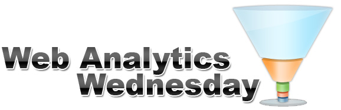



## About

Web Analytics Wednesdays are monthly informal gatherings of people in the digital analytics,
marketing and optimization space that
[happen](http://www.webanalyticsdemystified.com/wednesday/) in cities around the world.
Starting in 2013, Sydney will have one every month. Mark down the second Wednesday of each
month.

### What happens?

The event is intended to be a casual networking event where we can build a community
that shares knowledge and helps each other. Each month we'll have a couple of talks
about interesting stuff, then a short open mic period for announcements and commercial
plugs, then networking time.

### Free drinks!

Our generous sponsor [Datalicious](http://www.datalicious.com/) kindly pays
for drinks and room hire.

## Stay informed

* [Sign up for the announcement emails](http://eepurl.com/rVKLr "Annoucement list")
* [Follow us on Twitter](https://twitter.com/WAWSydney "WAWSydney Twitter")

## Talks wanted!

Found something cool you want to share? Think everyone's doing it wrong and you can
show them the _right_ way? Have you done something novel or interesting?

[Get in touch and do a talk](mailto:simon@simonrumble.com)

## Next event





<h3><a href="{{ post.url }}">{{ title }}</a></h3>
{{ content }}

## News

<ul class="posts">
  
    <li>{{ post.date | date_to_string }} &raquo; <a href="{{ BASE_PATH }}{{ post.url }}">{{ post.title }}</a></li>
  
</ul>

